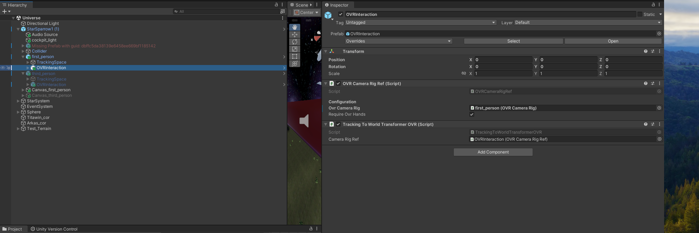

# 🚀 SpaceExplore VR 🚀
### **A VR Space Exploration Experience**

## **Introduction**
**SpaceExplore** is a VR project designed to provide users with an **immersive space exploration experience** focused on relaxation, discovery, and seamless planet landings. Inspired by open-world games like *Forza Horizon* and *No Man’s Sky*, this project enables users to **freely control a spaceship, traverse planets, and experience atmospheric landings**.

Built using **Unity 3D**, the project utilizes the **Meta XR Core SDK** and **Meta XR Interaction SDK** to ensure **smooth VR interactions, joystick-based spaceship controls, and realistic environment transitions**.

> **Note:** For this repository, the assets are not included due to their large file sizes and licensing restrictions. Some assets are not free to distribute. Please refer to the links below to obtain them:
> - **Spaceship:** [Star Sparrow Modular Spaceship (Free)](https://assetstore.unity.com/packages/3d/vehicles/space/star-sparrow-modular-spaceship-73167)
> - **Universe Background:** [Deep Space Skybox Pack (Free)](https://assetstore.unity.com/packages/2d/textures-materials/deep-space-skybox-pack-11056)
> - **Multi-Planets Texture:** [Procedural Planets and Stars (Not Free)](https://assetstore.unity.com/packages/vfx/shaders/substances/procedural-planets-and-stars-106662)
> - **Meta XR Core SDK:** [Download](https://developers.meta.com/horizon/downloads/package/meta-xr-core-sdk/)
> - **Meta Interaction SDK:** [Download](https://developers.meta.com/horizon/documentation/unity/unity-isdk-interaction-sdk-overview/)

---

## **🎮 Features**
- **VR Spaceship Control:** Navigate the spaceship using Oculus Quest controllers in first-person or third-person view.
- **Seamless Planet Landing:** Experience smooth transitions between space and planetary surfaces with atmospheric effects.
- **Dynamic Atmosphere Rendering:** Implemented a fading shader effect for realistic entry into a planet’s atmosphere.
- **Optimized Scene Transitions:** Designed custom landing algorithms to enhance immersion while maintaining performance.
- **Multiple View Modes:** Switch between first-person cockpit mode and third-person spaceship view dynamically.
- **Immersive Audio:** Implemented Meta XR Audio SDK for 3D spatial sound, enhancing the player's sense of presence.

---

## **🛠️ Project Setup**

### **1️⃣ Clone the Repository**
```bash
git clone https://github.com/YOUR_GITHUB_USERNAME/SpaceExplore.git
cd SpaceExplore
```
### **2️⃣ Install Required Packages**
Make sure you have Unity 2021.3+ (LTS recommended) installed.

#### **Import Meta XR SDKs**
You will need the following Meta XR packages for VR interactions and tracking:
- **Meta XR Core SDK:** Provides tracking, camera rig, and movement capabilities. 
  [Download Meta XR Core SDK](https://developers.meta.com/horizon/downloads/package/meta-xr-core-sdk/)
- **Meta XR Interaction SDK:** Handles controller input, UI interactions, and object grabbing. 
  [Download Meta Interaction SDK](https://developers.meta.com/horizon/documentation/unity/unity-isdk-interaction-sdk-overview/)

### **3️⃣ Import Project Assets**
Due to size and licensing restrictions, the following asset files are not included in this repository. Please obtain them from the Unity Asset Store:
- **Spaceship:** [Star Sparrow Modular Spaceship (Free)](https://assetstore.unity.com/packages/3d/vehicles/space/star-sparrow-modular-spaceship-73167)
- **Universe Background:** [Deep Space Skybox Pack (Free)](https://assetstore.unity.com/packages/2d/textures-materials/deep-space-skybox-pack-11056)
- **Multi-Planets Texture:** [Procedural Planets and Stars (Free)](https://assetstore.unity.com/packages/vfx/shaders/substances/procedural-planets-and-stars-106662)
- **Spaceship Cockpit:** [SF_Spaceship Cockpit C2 (Not Free)](https://assetstore.unity.com/packages/3d/vehicles/space/sf-spaceship-cockpit-c2-71108) 
- **Trees:** [Free Trees (Free)](https://assetstore.unity.com/packages/3d/vegetation/trees/free-trees-103208)
- **Rock:** [Rock package (Free)](https://assetstore.unity.com/packages/3d/props/exterior/rock-package-118182)
- **Cloud:** [Awesome Low Poly Fantasy Clouds (Free)](https://assetstore.unity.com/packages/3d/environments/awesome-low-poly-fantasy-clouds-97654)
- **Terrain:** [Terrain Textures Pack Free (Free)](https://assetstore.unity.com/packages/2d/textures-materials/nature/terrain-textures-pack-free-139542)
- **WaterShaders:** [Water Shaders V2.x (Free)](https://assetstore.unity.com/packages/vfx/shaders/water-shaders-v2-x-149916)
- **Environment Sound:** [Retro Sci-Fi BUNDLE (Free)](https://assetstore.unity.com/packages/audio/music/electronic/retro-sci-fi-bundle-208664)

After obtaining these assets, import them into Unity via the Package Manager or the Asset Store.

## **🌌 Implementation Details**

### **VR Tracking & Spaceship Control**
The project uses Meta XR Core SDK to set up the OVR Camera Rig and Tracking Space for accurate head and hand tracking. Spaceship navigation is implemented using `OVRInput` and `Rigidbody` physics.

### **Seamless Planet Landing System**
The landing system evolved through several methods:
1. **Large Sphere Inside the Planet:** Initially used but found impractical for VR scaling.
2. **Scene Transition at Altitude Threshold:** Effective but caused abrupt changes.
3. **Hybrid Approach:** Combines atmospheric fading via a shader with a gradual scene transition.

### **Atmosphere Shader (Fading Effect)**
The shader’s opacity is controlled by adjusting its properties based on the spaceship's altitude.

## **🎮 How to Play**

### **Meta Account Setup**
1. **Log In or Create a Meta Account**
   - Follow the link: [Meta Authentication](https://auth.meta.com/) to log in or create a Meta account.

2. **Set Up a Developer Account**
   - Create a Developer Account on [Oculus](https://developer.oculus.com/manage/). Follow the steps to set your Meta account for developer mode.
   - Verify your Meta Quest Developer Account using Text Message Two-Factor Authentication to avoid adding payment information.

3. **Create an Organization**
   - Go to [Oculus Developer Manage](https://developer.oculus.com/manage/) and create an organization using your full name. This enables development features in the Meta Quest Link desktop app.

### **Desktop Setup**
1. **Configure Meta Quest Link for Developer Mode**
   - Launch Meta Quest Link from the Desktop or search for it in the Start menu.
   - Log into your Meta Account and select [Link (Cable)] for the connection method.
   - Enable Unknown Sources in the General tab to allow most Unity development.
   - Under Settings -> Beta, enable features like Developer Runtime Features, Passthrough, Eye Tracking, and Natural Facial Expressions over Meta Quest Link.

### **Headset Setup**
1. **Verify Hand Tracking**
   - Ensure hand tracking is enabled by navigating to Settings in the Quick Settings menu, selecting Movement Tracking, and enabling Hand and Body Tracking along with related features.

2. **Set Up Quest Link (Headset)**
   - Open Quick Settings and enable Quest Link to start using the Rift environment.

### **Troubleshooting Quest Link**
- **If Quest Link disconnects or is not found**: Check PC activity, replug the headset, restart Quest Pro, or switch to another station if necessary.
- **If Quest Link is connected but blank**: Exit and re-launch Quest Link after ensuring Oculus app and Meta Account login on PC.
- **If Unity is not connected with Quest Link**: Exit Quest Link, replug the Oculus Link data cable, re-enter Quest Link, and run the scene in Unity. Restart Unity if needed.

### **Launching Unity and Meta Interaction SDK**
1. **Launch Unity**
   - Launch ‘Unity 2022.3.42f1 DMC’ (If you don't download, download first). Sign in to your Unity account.

2. **Set Up Meta Interaction SDK**
   - Create a new Unity project using the 3D template.
   - Add Meta XR Interaction SDK from the [Asset Store](https://assetstore.unity.com/packages/tools/integration/meta-xr-interaction-sdk-265014) to your project and install it via the Package Manager.
   - Import Example Scenes from the Meta XR Interaction SDK package. If prompted, import TMP Essentials.

3. **Experiment with Example Scenes**
   - Ensure the headset is running Quest Link and you are in the Rift environment.
   - Open and run example scenes such as the Locomotion Example from your Project window. Navigate to Edit > Project Settings if necessary adjustments are needed.

4. **Download all project assets you need**

### **Manage Project Hierarchy**
Ensure your project hierarchy and component setup are correctly configured for optimal performance and functionality. Follow these steps meticulously:

#### **Project Hierarchy Setup**
1. **Overview of 'Universe' Scene Hierarchy**
   - Refer to the following screenshot to understand the required hierarchy of the 'Universe' scene.
     

#### **Spaceship Setup**
2. **Spaceship Components**
   - Download and add the 'SF_Spaceship Cockpit C2' asset. Place the "Spaceship Cockpit" gameObject inside the 'StarSparrow1(1)' gameObject.
   - Download 'Immersive Audio' and create an `AudioSource` inside the cockpit to enhance the audio experience.

#### **Tracking and Interaction Configuration**
3. **Configure Tracking and Interaction**
   - Add 'TrackingSpace' from the 'Meta XR Core SDK' and 'OVR Interaction' from the 'Meta XR Interaction SDK' to both 'firstPerson' and 'thirdPerson' GameObjects inside the 'StarSparrow1(1)'.
     
   - Attach the necessary OVR configuration files under 'firstPerson' and 'thirdPerson' to ensure consistent camera data between the game and headset.
     
   - Under 'firstPerson/OVRInteraction' and 'thirdPerson/OVRInteraction', add the specified OVR and tracking files.
     

#### **Spaceship Physics and Interaction**
4. **Finalize Spaceship Setup**
   - Equip the 'StarSparrow1(1)' gameObject with components such as 'RigidBody' and a custom 'Landing.cs' script.
   - If you have the 'Multi-Planets Texture', find the planet named 'Arkas' and drag its 'Atmosphere' component to the 'Landing.cs' atm field.
   - Verify that your 'firstPerson' and 'thirdPerson' GameObjects are properly set up.
     
     

By following these structured steps, you ensure that each component and GameObject is properly configured for your VR experience in the 'Universe' scene.

  
  
   
### **Play Game **
- **Launch the Game:** Start the project in Unity and launch the game in VR (compatible with Meta Quest 2/Pro).
- **Control the Spaceship:** Use the joystick to navigate the spaceship through space.
- **Planetary Landing:** As you approach a planet, watch the atmosphere gradually fade and manually descend to land.
- **Explore:** Once landed, explore the planet's surface or take off again to resume space travel.

## **📌 Next Steps**
Future Features:
- Expanding to more planets with unique landscapes.
- Adding space stations for mid-space exploration.
- Implementing real-time AI assistant reporting.
- Implementing real-time atmosphere traversing crush sound
- Enhancing terrain details for improved realism.
- Debug automatic landing system

## **📜 License**
This project is for educational and personal development purposes. All assets used are subject to their respective licenses from the Unity Asset Store and Meta XR SDK. Redistribution of the assets is not permitted.

**GitHub Repo:** [GitHub Link](https://github.com/scofielddd/SpaceExplore)
